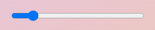
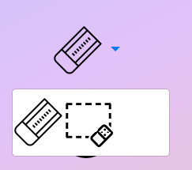
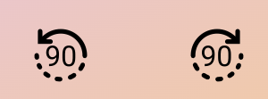

# Software Studio 2023 Spring
## Assignment 01 Web Canvas

### Scoring

| **Basic components**                             | **Score** | **Check** |
| :----------------------------------------------- | :-------: | :-------: |
| Basic control tools                              | 30%       | Y         |
| Text input                                       | 10%       | Y         |
| Cursor icon                                      | 10%       | Y         |
| Refresh button                                   | 5%        | Y         |

| **Advanced tools**                               | **Score** | **Check** |
| :----------------------------------------------- | :-------: | :-------: |
| Different brush shapes                           | 15%       | Y         |
| Un/Re-do button                                  | 10%       | Y         |
| Image tool                                       | 5%        | Y         |
| Download                                         | 5%        | Y         |

| **Other useful widgets**                         | **Score** | **Check** |
| :----------------------------------------------- | :-------: | :-------: |
| Change fill/stroke shape                         | 1~5%     | Y         |
| Erase rectangle area                             | 1~5%     | Y         |
| rotate canvas                                    | 1~5%     | Y         |
| flip canvas                                      | 1~5%     | Y         |

---

### How to use 
Simply click on corresponding image and draw on the canvas!

Brush:

Eraser:

Font:

Rectangle:

Circle:

Triangle:

Choose color:
  
Choose line width:
  
Choose font family and size:
  

Reset:

Download:

Upload:

Undo:

Redo:

### Bonus Function description

* change filled shape and stroked shape  
      
    When click on the circle, we can change the shapes into filled ones.  
    ex.  
       
       
* erase rectangle area  
    when click on the eraser image, a dropdown menu will appear like this:  
       
    the right one is to erase an rectangle area.   
    (After clicking it, the screen original eraser icon would be replaced like this)
       
* rotate canvas  
    click on this then the canvas will rotate 90 degree.    
       
    (the left is counter-clockwise, right one is clockwise)
    ex.  
      
      
* flip canvas
    click on this then the canvas will be flipped.    
      
    ex.  
      
    

### Web page link

[Web Canvas](https://web-canvas-afb02.web.app/)

### Others (Optional)
Some small detail:  
If the cursor is on a clickable img, it would change to a pointer.  
Also if there's nothing to undo/redo, it won't change.

